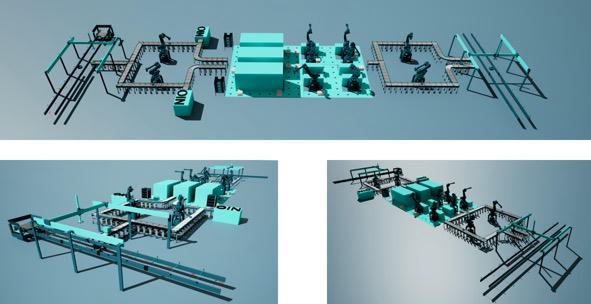

# HSU TwinFlow Benchmark

This repository contains the benchmark material for **HSU TwinFlow**, a living digital-twin-based benchmark for evaluating data-driven methods in cyber-physical production systems (CPPS).

The benchmark is designed for research on:

- Anomaly detection
- Fault diagnosis
- Resilient systems
- AI-based fault handling in production systems
- Digital-twin-generated industrial datasets

## Authors

- Nemanja Hranisavljevic — Helmut Schmidt University, Hamburg, Germany
- Alexander Diedrich — Helmut Schmidt University, Hamburg, Germany
- Lukas Moddemann — Helmut Schmidt University, Hamburg, Germany
- Domenic Schaeffer — Digital Twin Factory GmbH, Bad Oeynhausen, Germany
- Frank Marek — Novatio Solutions GmbH, Monheim, Germany
- Ingo Pill — Graz University of Technology, Graz, Austria
- Oliver Niggemann — Helmut Schmidt University, Hamburg, Germany

## Overview

HSU TwinFlow is based on a realistic digital twin of a production facility containing more than 100 interacting components, including conveyors, robots, autonomous mobile robots, robot stations, workstations, and goods input/output areas.



The benchmark provides scenario-based simulation data for both nominal and faulty operation. Fault scenarios are generated by injecting configurable failures into selected assets and recording the resulting system behavior.

## Repository Contents

This repository is intended to store:

- Digital twin system knowledge
- Scenario definitions
- Nominal operation datasets
- Fault-labeled evaluation datasets
- Ground-truth fault labels
- Benchmark scripts
- Evaluation protocols
- Example anomaly detection and diagnosis baselines
- Documentation for reproducing experiments

## System Knowledge Files

The repository contains several machine-readable files that describe the benchmark system independently from the generated time-series data:

- [`component_type_knowledge.json`](component_type_knowledge.json) defines reusable knowledge per component type prefix, such as `CC`, `RC`, `CLT`, `AMR`, `PR`, `RB`, and `RS`. Each entry separates observable variables, configurable parameters, and injectable fault types. Numeric configurable parameters include their valid `min` and `max` range, while fault types include the value used to repair or reset the injected fault.
- [`conveyor_segments.json`](conveyor_segments.json) groups adjacent conveyor components into named logical segments, for example consecutive `CC_*` or `RC_*` transport paths. These groups are useful for plotting, aggregation, and interpreting faults that affect a local transport section rather than a single isolated conveyor.
- [`structural_hierarchy.json`](structural_hierarchy.json) defines the physical hierarchy of the digital twin as area -> component type -> component identifiers. It assigns components to functional areas such as AMR, PAR, VZ, WA, and WE, and intentionally keeps variable and fault definitions separate from the hierarchy.

## Benchmark Tasks

### Anomaly Detection

Models are trained or configured using nominal system behavior and evaluated on test sequences containing injected faults. The benchmark provides point-wise anomaly labels for evaluating detection performance.

### Fault Diagnosis

Diagnosis methods are evaluated by their ability to identify the affected component and the corresponding fault type. The benchmark includes structured system information to relate variables, assets, and functional areas.

## Dataset Design

The benchmark uses high-level scenario definitions to generate reproducible simulation runs. Faults are introduced, kept active for defined intervals, and then repaired. Ground truth is derived directly from the scenario actions, including the affected component, fault type, and timestamps.

Initial fault categories include failures affecting conveyors, autonomous mobile robots, and six-axis robots.

## Scenarios

Scenario files are stored in [`scenarios/training`](scenarios/training) and [`scenarios/test`](scenarios/test). They are the simulator input definitions used to generate the raw files in [`data/training`](data/training) and [`data/test`](data/test).

Each scenario JSON contains metadata under `scenario` and a time-ordered `actions` list. Actions create pallets with the `PalletCreator` or inject and repair faults by setting a component property at a specific `startsAt` timestamp. Fault actions are paired with repair actions, so the scenarios define the ground truth for anomaly labels and fault-diagnosis targets.

The training scenarios contain repeated nominal or low-fault-rate runs, such as `0_0pct_faults_rep_1.json`, `1_0pct_faults_rep_1.json`, and `10_0pct_faults_rep_1.json`. The test scenarios contain area-specific and multi-fault evaluations, such as `AMR_30pct_faults.json`, `VZ_multi_2_30pct_faults.json`, and `WE_multi_2_30pct_faults.json`.

Raw simulation export files are stored in the [`data`](data) folder. These files are kept close to the simulator output format. More comprehensable benchmark datasets will be added later through Zenodo.

Current raw training files in [`data/training`](data/training):

- `0_0pct_faults_rep_1.json.zst`
- `0_0pct_faults_rep_2.json.zst`
- `0_0pct_faults_rep_3.json.zst`
- `1_0pct_faults_rep_1.json.zst`
- `1_0pct_faults_rep_2.json.zst`
- `1_0pct_faults_rep_3.json.zst`
- `10_0pct_faults_rep_1.json.zst`
- `10_0pct_faults_rep_2.json.zst`
- `10_0pct_faults_rep_3.json.zst`

Current raw test files in [`data/test`](data/test):

- `AMR_30pct_faults.json.zst`
- `AMR_multi_2_30pct_faults.json.zst`
- `PAR_30pct_faults.json.zst`
- `PAR_multi_2_30pct_faults.json.zst`
- `VZ_30pct_faults.json.zst`
- `VZ_multi_2_30pct_faults.json.zst`
- `WA_30pct_faults.json.zst`
- `WA_multi_2_30pct_faults.json.zst`
- `WE_30pct_faults.json.zst`
- `WE_multi_2_30pct_faults.json.zst`

Example loading workflow:

```python
from utils import read_json_zst

df = read_json_zst("data/training/0_0pct_faults_rep_1.json.zst")
```

This reads the compressed simulator export into a pandas DataFrame indexed by `simulationTime`.

## Pallet configurations

The benchmark includes several predefined pallet configurations used by the scenario generator. These configurations define the product types placed on a pallet and their production routes through the robot stations.

Currently, defined configurations include:

- `PalletConfiguration-NOVA-6-DTF-6`
- `PalletConfiguration-NOVA-DTF-HSU-Mix`
- `HSU-1Box`

For details on product layouts and production routes, see [`docs/pallet_configurations.md`](docs/pallet_configurations.md).

## Citation

This repository accompanies the paper:

**HSU TwinFlow: A Living Benchmark for Evaluating Anomaly Detection and Diagnosis Methods in Cyber-Physical Production Systems Using Digital-Twin-Generated Data**

submitted at the **The 37th International Conference on Principles of Diagnosis and Resilient Systems (DX'26)**.

Please cite the paper when using this benchmark material.

## License

This repository uses separate licenses for code and non-code material.

### Code

All source code, scripts, baseline implementations, and software utilities in this repository are licensed under the **MIT License**.

See [`LICENSE`](LICENSE) for details.

### Data and Benchmark Material

All datasets, scenario definitions, labels, documentation, figures, and other non-code benchmark material are licensed under the **Creative Commons Attribution 4.0 International License (CC BY 4.0)**.

See [`LICENSE-DATA`](LICENSE-DATA) for details.

### Summary

- Code: MIT License
- Datasets and benchmark material: CC BY 4.0
